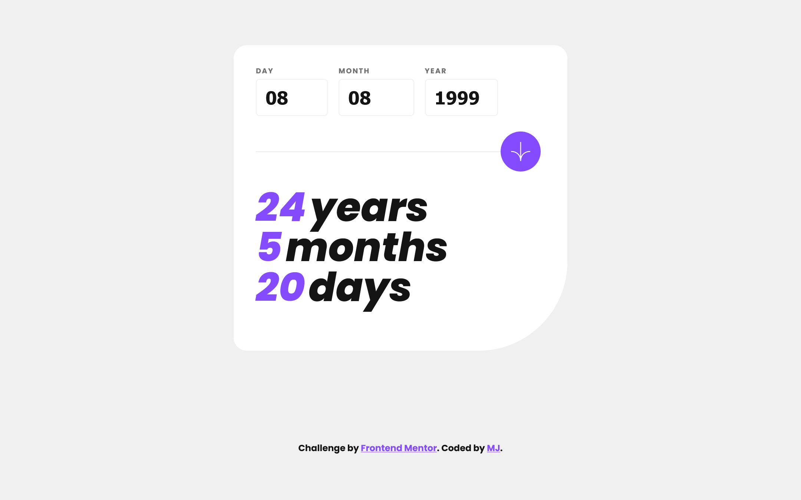
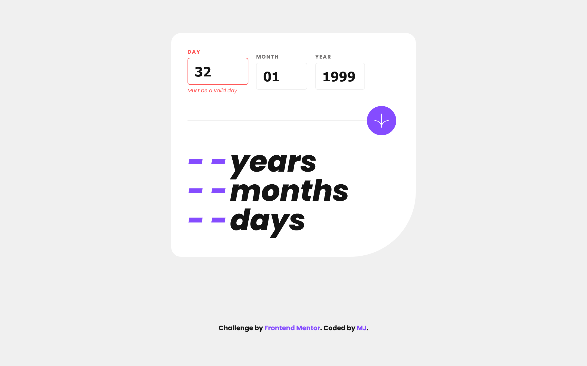

# Frontend Mentor - Age Calculator solution

This is my solution to the [Age Calculator challenge on Frontend Mentor](https://www.frontendmentor.io/challenges/age-calculator-app-dF9DFFpj-Q/hub). Frontend Mentor challenges help you improve your coding skills by building realistic projects. 

### Overview

### Links

- Solution URL: [Click to view Solution](https://www.frontendmentor.io/solutions/age-calculator-using-js-2K5ZwtZL7c)
- Live Site URL: [Click to view Live Site](https://coded-by-mj.github.io/Front-end-Mentor-Challenge4/)

## My process

### Built with
- Semantic HTML5 markup
- CSS custom properties
- Flexbox
- CSS Grid
- JavaScript

## Author

- Frontend Mentor - [@Coded-by-MJ](https://www.frontendmentor.io/profile/Coded-by-MJ)
- Twitter - [@Coded-by-MJ](https://twitter.com/Coded_by_MJ)
